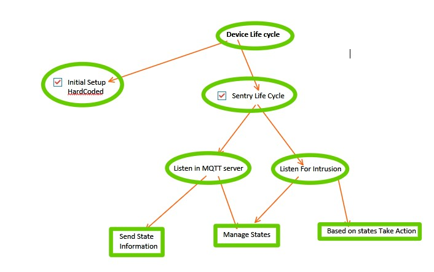
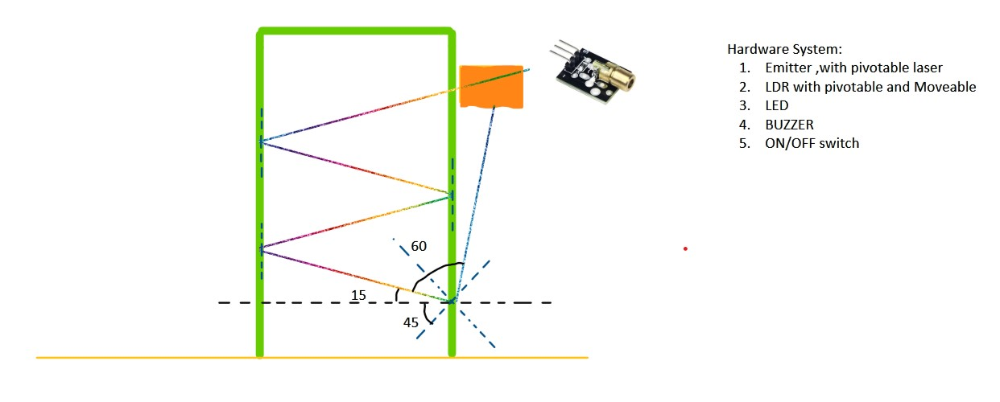

# Home Security System

This project aims to create a comprehensive home security system using hardware components integrated with a mobile application. The primary objective is to establish secure communication with the highly scalable and reliable HiveMQ MQTT server. The system will publish updates to a specific topic to notify users of any detected intrusion using a laser-based perimeter breach detection mechanism. Additionally, the system will integrate with a mobile phone application for easy user interaction and secure door unlocking.

## Purpose

The main purpose of this project is to enhance home security by leveraging modern technology. By utilizing a laser-based perimeter breach detection system and integrating it with a mobile application, users can receive real-time updates about any potential intrusion attempts. The integration with the HiveMQ MQTT server ensures reliable and scalable communication between the hardware components and the mobile application.

## Features

- **Secure Communication:** Establishes secure communication with the HiveMQ MQTT server to ensure data integrity and confidentiality.
- **Perimeter Breach Detection:** Utilizes a laser-based perimeter breach detection mechanism to detect any intrusion attempts.
- **Mobile Integration:** Integrates with a mobile phone application for easy user interaction and remote monitoring.
- **Door Unlocking:** Provides secure door unlocking functionality through the mobile application.
- **Scalability:** The system is highly scalable, allowing for easy expansion and integration with additional sensors or devices.

## Getting Started

To set up the Home Security System, follow these steps:

1. **Hardware Setup:** Refer to the provided hardware schematics and circuit diagram (see `screenshots/CircuitDiagram.jpg` and `screenshots/HardwareSchematics1.jpg`) for guidance on setting up the hardware components.
   
2. **Mirror Angles Setup:** Configure the mirror angles for optimal performance of the perimeter breach detection system (see `screenshots/MirrorAnglesSetup.jpg`).

3. **Mobile Application:** Download and install the mobile application from the [SecurityHomeApp repository](https://github.com/Michael-Pio/SecurityHomeApp).

4. **Configuration:** Configure the mobile application to connect to the HiveMQ MQTT server and subscribe to the appropriate topic for intrusion updates.

5. **Testing:** Test the system by simulating intrusion attempts and verifying that updates are published to the MQTT server and reflected in the mobile application.

## Screenshots

*Figure 1: Circuit Diagram*

*Figure 2: Device Lifecycle*

*Figure 3: Hardware Schematics*

*Figure 4: Mirror Angles Setup*

*Figure 5: MQTT States Maintained*

## Contributors

- **Michael Pio**: Lead Developer - [GitHub Profile](https://github.com/Michael-Pio)

## License

This project is licensed under the [MIT License](LICENSE). See the LICENSE file for details.
